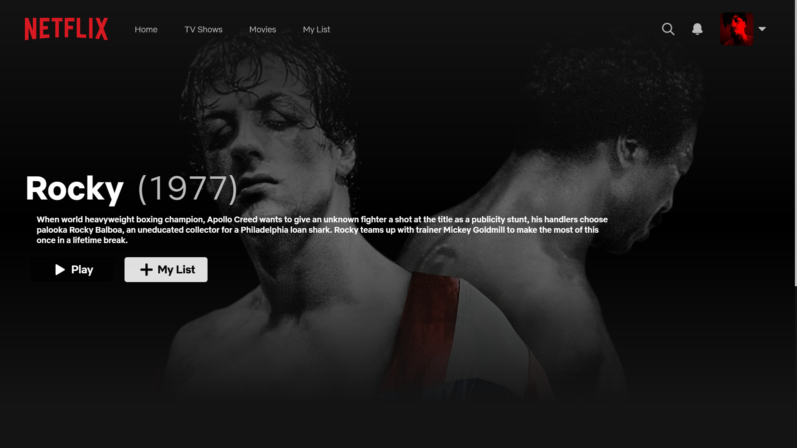
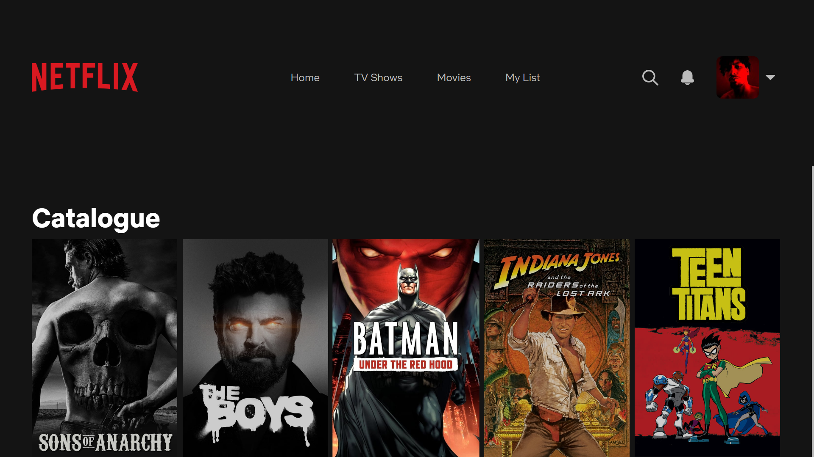

# **Netflix**

Recriação e reimaginação da página inicial do site da NETFLIX, utilizando HTML5, CSS3 e Javascript puro!

###

Re-creation and re-imagining of the NETFLIX website homepage, using HTML5, CSS3 and pure Javascript!

#

  
  
  ##

  

 

#
## 
>
Tecnologias

  
  
  
    
  

 

#

   

 
   

